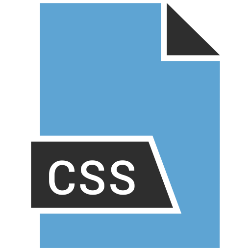

<!--
**MrDaubinet/MrDaubinet** is a ✨ _special_ ✨ repository because its `README.md` (this file) appears on your GitHub profile.

Here are some ideas to get you started:

- 🔭 I’m currently working on ...
- 🌱 I’m currently learning ...
- 👯 I’m looking to collaborate on ...
- 🤔 I’m looking for help with ...
- 💬 Ask me about ...
- 📫 How to reach me: ...
- 😄 Pronouns: ...
- ⚡ Fun fact: ...
-->

### Hi there 👋 My Name is ✨ Jordan Daubinet ✨ 
- 🔭 I’m currently working on [My Blog](https://mrdaubinet.github.io/)
- 🌱 I’m currently learning: 

  -> 🔣 Natural Language Processing  
  -> 🤖 Reinforcement Learning   
  -> 🖼️ Neural Style Transfer 

### Connect with me:

[][website]
[][linkedin]
[][instagram]

 

### Languages and Tools:

 
 

---

### 📕 Latest Blog Posts
<!-- BLOG-POST-LIST:START -->
- [The One True Version Control](https://mrdaubinet.github.io/The-One-True-Version-Control/)
- [This is my world, and its all for me](https://mrdaubinet.github.io/This-is-Me/)
<!-- BLOG-POST-LIST:END -->
---

[website]: https://mrdaubinet.github.io/
[instagram]: https://www.instagram.com/jordan_daubinet/
[linkedin]: https://www.linkedin.com/in/jordan-daubinet/